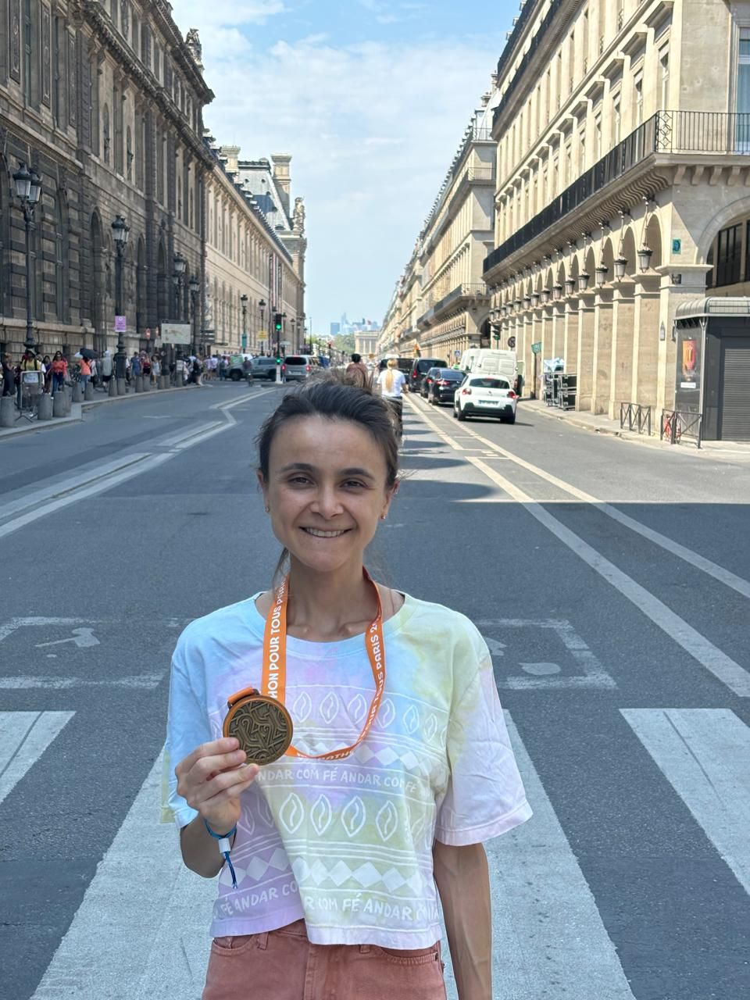
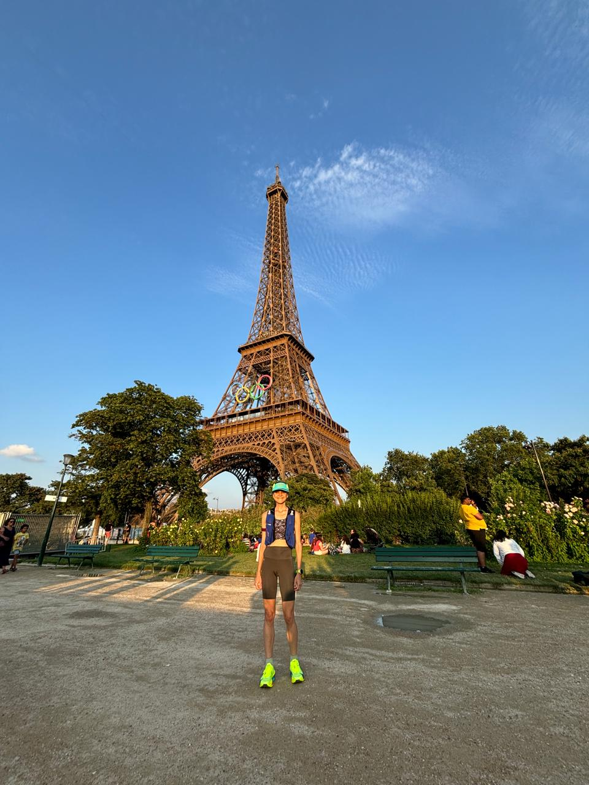

## Running

I’m an amateur athlete and passionate runner - read marathoner, trail and ultra-runner. I have a deep passion, excitement and dedication for the sport. Running brings balance, discipline, curiosity and joy to my life and work.
If you’re a fellow runner and we happen to be at the same conference, event or if you are in Barcelona, shoot me an email!Instead of coffee, let's go for a run together.

::: {.columns}

::: {.column width="50%"}
{width=80%}
:::

::: {.column width="50%"}
{width=80%}
:::

:::

**Most recent races 2025**

- 24 horas de Ultrafondo en Pista de Barcelona - 6h / 63.9km (December)

- UTMB Mallorca 27k (November)

- Chicago Marathon 2025 (October)

**Upcoming races in 2026**

- Sevilla Marathon (February)

- Swiss Canyon Trail (May)

**The why if you’re curious…**

During the end of my PhD, in 2022, I discovered running, and more specifically, marathons. What began as a simple escape from the pressures and stress of academic life quickly evolved into a profound journey of endurance, resilience, and self-discovery.
Much like research, long-distance running requires perseverance, patience, and a willingness to embrace discomfort. Both are powerful because success is not just about the final outcome but about the commitment to the process. You experience moments of happiness and inevitable fears, stunning victories along the way and humbling failures. It’s all about the courage to keep moving forward even when the path is unclear and challenging. Every step brings you closer to a goal that seems impossible at times.
Running has become more than a hobby; it’s a practice that fuels my academic work, offering clarity and a sense of purpose. The true value lies not just in the achievement but in the person you become through the journey. It’s in the moments of doubt and fatigue that the true magic happens, where you discover not just your physical limits, but your mental and emotional strength as well.